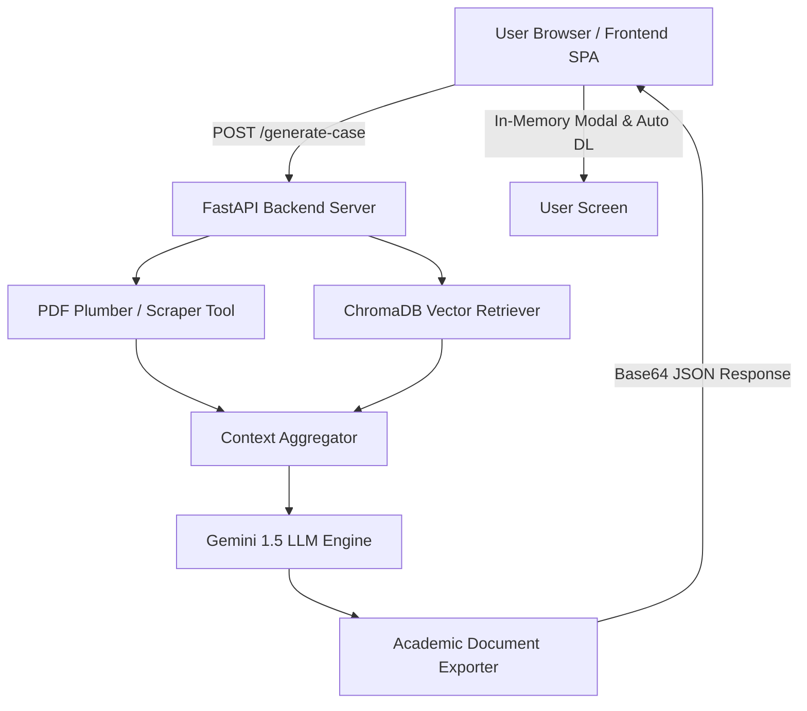

# CaseIQ — AI-Powered Business Case Study Generator


> **Built for IFQM Banglore by [Viva Baranwal](https://vivabaranwal.vercel.app/)**

CaseIQ converts raw company research, uploaded PDFs, scraped web links, and strategic dilemmas into publisher-grade, academically structured business case studies in under 10 minutes.

---

## 🌟 Key Features & Capabilities

- **6 Official Citation Styles**: Supported formats include **General (No Citation)**, **APA 7th Edition**, **APA 6th Edition**, **Harvard Referencing**, **Chicago 17th (Footnotes)**, and **MLA 9th Edition**.
- **Dynamic Citation-Aware Section Ordering**: Automatically arranges section structures based on citation style guidelines:
  - *General Citation*: `BACKGROUND` → `CHALLENGE` → `ROOT CAUSE ANALYSIS` → `INTERVENTION / APPROACH` → `IMPLEMENTATION` → `RESULTS AND IMPACT` → `RECOMMENDATIONS` → `FUTURE SCOPE`
  - *Academic Formats*: `BACKGROUND` → `THEMES` → `INTERVENTION` → `RESULTS`
- **Instructor Teaching Notes**: Generates a clean, separate `teaching_note.docx` for faculty featuring Learning Outcomes, Discussion Questions, Teaching Plan, Key Concepts, Synopsis, and Classroom Guidance.
- **Zero-Corruption Word Export**: Modern python-docx formatting ensures clean Word document creation without XML parsing errors.
- **In-Memory Case Preview Modal**: View formatted case study text instantly on Screen 8 without saving data to disk or localStorage.
- **Multi-Format Export Support**: Download formatted documents in Microsoft Word (`.docx`), PDF (`.pdf`), and BibTeX (`.bib`).

---

## 🏗️ System Architecture



---

## 📁 Repository Clean Architecture

```
ai_casestudy/
├── backend/                  # FastAPI Application Service
│   ├── app.py                # REST API Endpoints (/generate-case/, /export-pdf/)
│   ├── config.py             # Environment Configuration
│   ├── generator.py          # Gemini AI Completion Engine & Prompt System
│   ├── exporter.py           # Word (.docx) Academic Document Formatter
│   ├── citation_formats.py   # Citation Rules & Section Mapping Mappings
│   ├── retriever.py          # Vector Store (ChromaDB) Retrieval Engine
│   └── scraper.py            # Web Scraping Service
│
├── scripts/                  # Modular Single-Page App Logic
│   ├── config.js             # Dynamic API Environment Resolution
│   ├── formState.js          # Application State Store
│   ├── main.js               # Application Entrypoint
│   ├── router.js             # Wizard Screen Router
│   ├── screens/              # Individual Screen Controllers (Screens 0–8)
│   └── utils/                # Animations & Helper Utilities
│
├── styles/                   # Glassmorphism Design System & Screen Styles
│   ├── base.css, components.css, layout.css, animations.css
│   └── screens/              # Screen-specific Styles
│
├── tools/                    # Data Ingestion & ETL Utilities
│   ├── parse_cases.py        # Case Document Extraction Pipeline
│   ├── augment_cases.py      # Case Data Augmentation Utility
│   ├── build_index.py        # ChromaDB Index Builder
│   └── test_query.py         # Vector Search Diagnostics
│
├── data/                     # Datasets & ChromaDB Vector Embeddings
├── mock/                     # Offline Fallback Data
├── index.html                # Main Frontend Single-Page App Entrypoint
├── vercel.json               # Vercel Frontend Deployment Manifest
├── render.yaml               # Render Backend Web Service Manifest
├── .env.example              # Environment Variables Template
└── requirements.txt          # Python Production Dependencies
```

---

## 🚀 Quick Start (Local Development)

### 1. Backend Setup
```bash
# Navigate to backend directory
cd backend

# Configure your Gemini API key in backend/.env
echo "GEMINI_API_KEY=your_gemini_api_key_here" > .env

# Install python dependencies
pip install -r ../requirements.txt

# Launch FastAPI backend
python -m uvicorn app:app --reload --port 8000
```
*Backend runs at: `http://127.0.0.1:8000`*

### 2. Frontend Setup
In a new terminal:
```bash
# Serve static frontend files
python -m http.server 8080
```
*Open `http://localhost:8080` in your web browser.*

---

## 🌐 Production Deployment

### Frontend (Vercel)
- Connect this GitHub repository to [Vercel](https://vercel.com).
- Vercel automatically detects `index.html` and `vercel.json`.
- Click **Deploy**.

### Backend (Render / Railway)
- Connect this GitHub repository to [Render](https://render.com).
- Create a new **Web Service** using `render.yaml`:
  - **Build Command**: `pip install -r requirements.txt`
  - **Start Command**: `uvicorn backend.app:app --host 0.0.0.0 --port $PORT`
  - **Environment Variable**: `GEMINI_API_KEY`

---

## 👤 Author & Credits

Designed and developed for **IFQM Banglore** by **[Viva Baranwal](https://vivabaranwal.vercel.app/)**.
